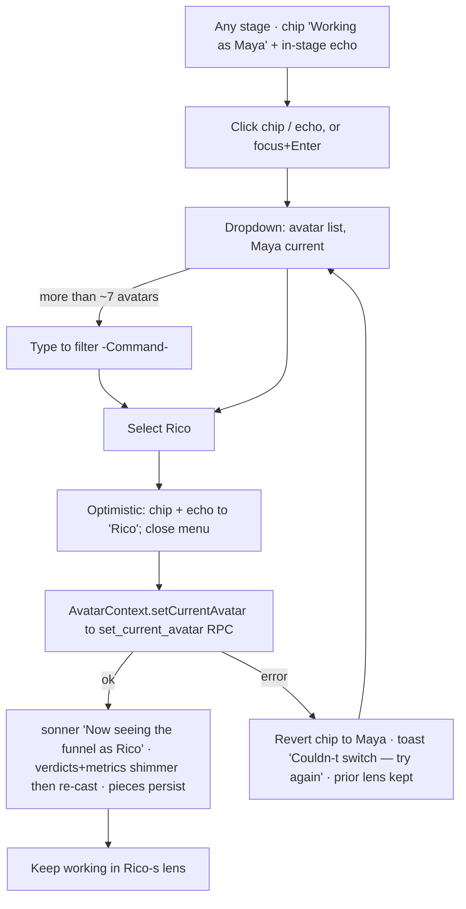
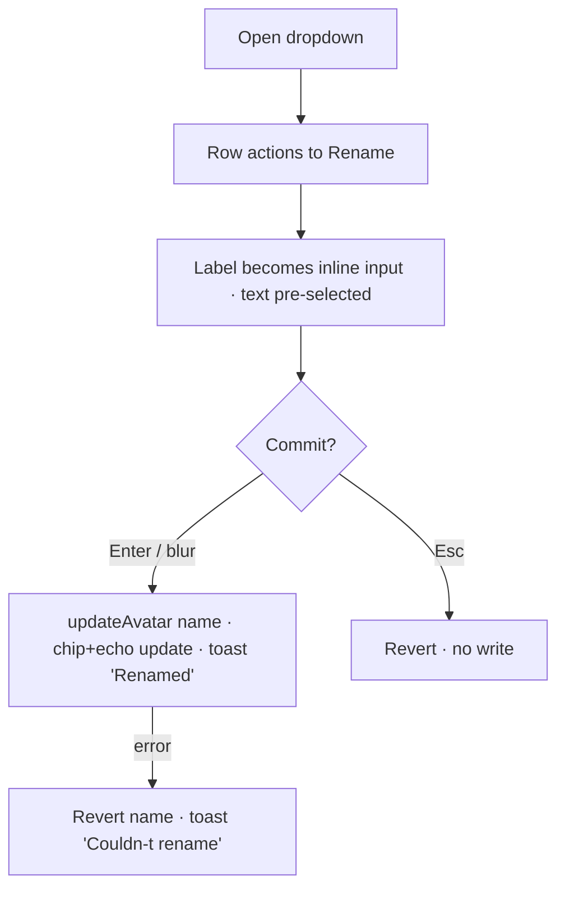
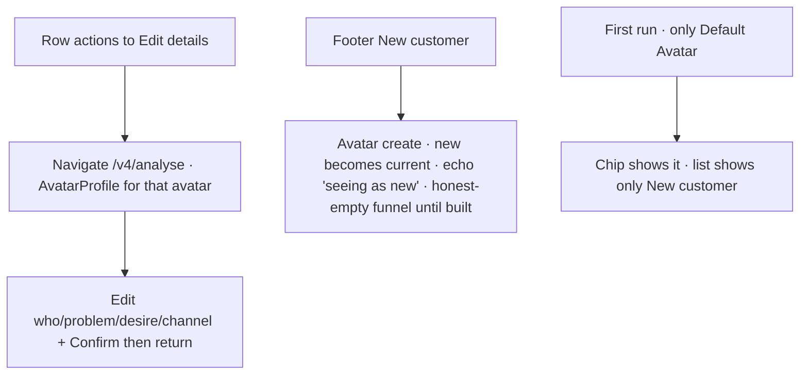

# UX Design Specification — Customer Avatar Control (idea-brand-coach /v4)

**Author:** Matthew
**Date:** 2026-06-29
**Focus:** A discoverable, global control in the v4 shell to **switch the active customer Avatar** and **edit its name + description** — closing the gap where FORCE_V4 dropped the v2 avatar management UI and left the switcher as a "future control."

---

## Executive Summary

### Project Vision

A single, always-present **Customer Avatar control** in the `/v4` shell that lets a brand owner see *which customer they're working as*, switch between their avatars, and edit the active avatar's **name + four-field portrait** — from anywhere, no hunting. It closes the dead-end the single-surface (`FORCE_V4`) flip created when it dropped the v2 avatar-management UI and left the switcher as a deferred "future control."

### Target Users

Brand owners / marketers (intermediate tech comfort) running the IDEA spine (Diagnose → Analyse → Fix → Re-measure → Defend) for **one brand with several customer avatars**. They think *"the customer I'm designing for right now."* Mostly desktop for the deep work; the shell is responsive (sidebar rail + mobile top bar). The pain surfaces exactly when a funnel/analysis is scoped to the wrong — or no — avatar and there's no obvious way to change it.

### Key Design Challenges

1. **No home for it** — no global avatar control exists; the only switcher is buried in the Fix-funnel toolbar (`FunnelMap`) and only appears once pieces load (the observed dead-end).
2. **Two identities, one mental model** — the account *owner* (`ProfileMenu`, keyed by email) vs the customer *Avatar* must stay unmistakably distinct; the shell deliberately reserves the word "Avatar" for the customer.
3. **Safe switching (brand-scoped funnel)** — funnel **pieces are brand-level** (shared across the brand's avatars; brand-scoping is **SHIPPED — T11, 2026-06-29**: the frontend Fix funnel now reads pieces by `brand_id` and overlays **audit + metrics per-avatar**, verified live in prod). So switching the active avatar does **not** change *which* pieces show — it re-casts the **per-avatar audit verdicts + metrics** overlaid on the shared funnel (`AvatarContext.setCurrentAvatar` → `set_current_avatar` RPC, live). The switch must refresh those overlays cleanly and *visibly*, with no stale per-avatar scores bleeding across the change.
4. **Name vs portrait** — v4 edits the 4-field description (in Analyse `AvatarProfile`) but has *no rename*; we need low-friction rename + a jump into portrait editing without rebuilding the Analyse flow.
5. **Empty / single-avatar states** — one default avatar (nothing to switch) shouldn't feel broken; many avatars shouldn't overwhelm.

### Design Opportunities

1. **A persistent identity anchor** — a top-of-shell *"working as: {avatar}"* control (the proven v2 `AvatarHeaderDropdown` pattern, restyled for the v4 dark shell) makes the active customer ambient and switchable everywhere.
2. **Inline rename + jump-to-edit** — rename in place; "Edit details" deep-links to the Analyse `AvatarProfile` (reuse, don't rebuild).
3. **Switch-with-confidence** — a quiet confirmation ("Now working as {avatar} — funnel + analysis re-scoped") turns a scary global change into a reassuring one.

---

## Plan Reconciliation (2026-06-29, post-T11)

The avatar story is spread across several docs written at different times against different trees.
This reconciles them against **verified-live prod schema** so there is one canonical model.

### Canonical model (what is actually TRUE on live)
- **One brand per user; many customer avatars under it.** `brands` (unique `user_id`, `primary_avatar_id`)
  is the anchor; `avatars.brand_id` is **NOT NULL** + `avatars.is_primary` (one primary per brand).
- **Two-tier scoping is LIVE (P1 schema applied):** funnel **pieces are brand-level** (`brand_assets.brand_id`,
  one current row per `(brand, touchpoint)`); the **per-avatar layer is the evaluation** —
  `brand_asset_audits` overlay (now carries per-avatar `status`/`score`/`audit_result` after T11) +
  per-avatar metrics. RPCs `set_current_avatar`, `set_primary_avatar`, `save_asset_audit_atomic` are **live**.
- **T11 (this session, SHIPPED)** brought the **frontend** Fix funnel onto that model: it reads pieces by
  brand and overlays the verdict per active avatar. Verified live — switching avatars keeps the same
  pieces, re-casts the verdict. This is exactly the "switch = re-cast the lens, pieces persist" behaviour
  this control's design assumes.

### Document status (reconciled)
| Doc | Status | Reconciliation |
|---|---|---|
| **this** `ux-design-avatar-control.md` | **current** | The canonical UX spec for the global avatar switcher. "In-flight migration" note corrected → SHIPPED (T11). |
| `docs/v2/architecture/MULTI_AVATAR_DESIGN.md` | **superseded-in-part** | Its load-bearing premise "avatars has no `brand_id` on live" is **stale** — P1 schema has since shipped (brand_id/is_primary/brand_assets brand-scoped/audits/RPCs all live). The two-tier *intent* stands; the "not on live" caveats are obsolete. |
| `docs/MULTI_AVATAR_RUNBOOK.md` | **partly live** | P1 schema **live**. P2 (MCP tools), P3 (consultant edge-fn scope-authoritative retrieval), P4 (SPA avatar CRUD/switch UX) are code-complete on `feat/brand-avatar-scope` but **NOT deployed** — the SPA switcher UX this doc specs is therefore **not yet built in prod** (the dead-end the user hit). |
| `docs/SINGLE_AVATAR_*` (READY/WORKFLOW/SIMPLE) | **superseded** | One-avatar-per-account field-persistence plans; obsoleted by the multi-avatar two-tier model now live. Keep only as history. |

### What this means for the build
- The switcher design (Direction D — global rail chip + in-stage echo) **holds unchanged** against the
  live model; its core dependency (`set_current_avatar` RPC + `AvatarContext.setCurrentAvatar`) is live.
- The switcher itself is **spec'd but not yet built in prod** (FORCE_V4 dropped the v2 `AvatarHeaderDropdown`;
  MULTI_AVATAR P4b SPA UX is undeployed). Building it is the implementation follow-up to this spec.
- No schema work remains for the switcher — T11 + P1 already provide the brand-scoped pieces + per-avatar
  overlay it re-casts.

---

## Core User Experience

### Defining Experience

The defining act is **"work as a customer — and change who that is."** The funnel **pieces are brand-level (shared)**; the per-avatar layer is the **audit verdicts + metrics** every spine engine reasons over (Trust Gap, Decision Trigger, Moves, Brief). So the highest-value interaction is: at a glance *know* which customer you're working as; in one move **switch the lens** — the same pieces, re-judged for the selected customer (the piece set doesn't change); and from the same spot *rename or edit*. **Switching the lens is the hero; rename/edit are its close companions.**

### Platform Strategy

Lives in the existing v4 shell, responsive by the established pattern — desktop **left sidebar rail** (full: avatar name + chevron) and mobile **top bar** (compact: avatar chip), mirroring how `ProfileMenu` already splits `full`/`compact`. Mouse/keyboard + touch (≥44px targets; keyboard/focus a11y via the shell's shadcn `DropdownMenu`). No offline need. It sits **adjacent to but visually distinct from** the account `ProfileMenu` — owner ≠ customer.

### Effortless Interactions

- Current avatar is **always visible** in the shell — zero thought to answer "who am I working as?"
- **Switch in ≤2 taps** from any stage, no page reload; the spine re-scopes in place.
- **Rename inline** from the control — no builder dive.
- **Auto re-scope + auto-confirm** — picking an avatar updates the funnel/analysis and says so; the user never manually refreshes.

### Critical Success Moments

- **Orientation** — the instant a user glances and knows which customer is active (kills the "is this scoped right?" doubt).
- **The re-scope moment** — open switcher → pick the right customer → watch the funnel's verdicts + numbers re-cast to *that* customer (same pieces, this customer's truth). Reaching it at all was impossible before (the observed dead-end).
- **First rename** — "Default Avatar" → a real name, in seconds, in place.
- **The failure to avoid** — a switch that *looks* done but leaves a stage showing the old avatar's data (stale bleed); that would wreck trust in the scope.

### Experience Principles

1. **Always know who you're working as** — the active customer is ambient, never hidden.
2. **One move, from anywhere** — switching is never more than a tap or two, on any stage.
3. **Owner is not the customer** — account menu and Avatar control stay visibly separate.
4. **Switch is safe and spoken** — every switch re-scopes cleanly and confirms in plain words.
5. **Reuse, don't rebuild** — deep portrait edits route to the Analyse `AvatarProfile`; this control owns only switch + rename + the jump.

---

## Desired Emotional Response

### Primary Emotional Goals

**Oriented and in control.** *"I always know which customer I'm working as, and I can change that lens the instant I need to."* The deliberate antidote to the trapped, second-guessing feeling of the dead-end.

### Emotional Journey Mapping

- **First glance:** quiet *recognition* — "that chip is the customer I'm seeing the funnel through."
- **Switching:** *control*, not anxiety — choosing a customer feels as safe as switching a tab; nothing is destroyed (pieces stay; the *judgement* changes).
- **Right after a switch:** *reassurance* — a plain-words confirm ("Now seeing the funnel as {avatar}") tells them the verdicts + numbers re-cast; they trust the new view.
- **When it fails:** *recoverable*, never *lost* — a failed switch keeps the prior lens with a clear retry.
- **On return:** *familiarity* — same place, same chip, every time.

### Micro-Emotions

**Confidence over Confusion** (which lens am I in?), **Trust over Skepticism** (did the scores really re-cast to this customer?), **Control over Helplessness** (the dead-end's exact emotion), plus quiet **Ownership** from naming their own customer.

### Design Implications

- **Always-visible current-avatar chip** → confidence + orientation.
- **Explicit "seeing as {avatar}" confirm on switch** → trust the re-cast.
- **Visually distinct from the account `ProfileMenu`** → kills "did I change my *account*?" anxiety.
- **Inline rename** → ownership without ceremony.
- **Deep edits jump to the Analyse portrait** → no overwhelm.
- **Avoid:** silent re-cast (doubt), a switcher hidden until data loads (helplessness — the original bug), stale per-avatar scores after a switch (broken trust).

### Emotional Design Principles

1. **Orientation before action** — never wonder which lens you're in.
2. **Make the powerful feel safe** — a global re-cast is reassured, not silent.
3. **Separate the two "me"s** — owner vs customer never blur.
4. **Light touch, deep door** — quick switch/rename here; the real editing room is one click away.

---

## UX Pattern Analysis & Inspiration

### Inspiring Products Analysis

- **Slack / Linear / Notion — workspace switcher.** A persistent chip at the top of the left rail (icon + name + chevron) that opens a list to switch. Always there, answers "where am I?" at a glance, switch in one click. The closest analog to *"working as {customer}."*
- **Google account switcher.** Deliberately *separates* "manage your Account" (owner) from "switch account" (context) — exactly our owner-vs-customer split.
- **Stripe test/live mode.** Persistent, color-coded indicator + explicit signal that you changed *lens* — the model for "you're now seeing this as {avatar}."
- **Notion inline rename.** Click the title, edit in place, no dialog — the model for renaming an avatar.
- **Our own v2 `AvatarHeaderDropdown`.** Internal precedent that already did switch + manage; the muscle memory exists.

### Transferable UX Patterns

- **Navigation:** persistent top-of-rail context chip (Slack/Linear) → always-visible "working as {avatar}."
- **Interaction:** dropdown with current-checkmark + per-row "⋯" (rename / edit details) + "＋ New customer"; inline rename (Notion); searchable list when many (Slack).
- **Feedback:** post-switch confirm / lens indicator (Stripe) → "Now seeing the funnel as {avatar}."
- **Identity separation:** owner control visibly distinct from context control (Google).

### Anti-Patterns to Avoid

- **Conflating owner and customer** in one menu — the #1 confusion risk.
- **Hiding the switcher** behind settings or a single screen (the current dead-end).
- **Silent switch** with no confirmation — user can't tell it took.
- **Heavy modal** for a frequent micro-action — keep it a lightweight dropdown.
- **Breaking on one avatar** — don't show an empty/confusing switcher when there's nothing to switch to.

### Design Inspiration Strategy

- **Adopt:** Slack/Linear persistent top-of-rail chip + dropdown; Stripe-style "seeing as {avatar}" confirm; Notion inline rename.
- **Adapt:** restyle to the v4 dark shell + the `ProfileMenu` full/compact split; reuse v2 `AvatarHeaderDropdown` logic; keep it light for intermediate users + small avatar counts.
- **Avoid:** owner/customer conflation; hidden switcher; silent switch; heavy modal; broken single-avatar state.

---

## Design System Foundation

### 1.1 Design System Choice

**Themeable system, already in place: shadcn-ui (Radix primitives) + Tailwind CSS**, themed to the v4 dark shell. Not a new choice — the avatar control extends the *same* primitives behind `ProfileMenu` (`DropdownMenu` + `Avatar`). **No new dependency** (per project rules, adding one is "ask first").

### Rationale for Selection

- **Native consistency** — the control must read as part of the v4 shell, beside `ProfileMenu`: same primitives → same look, motion, focus ring (`gold-warm`), dark-shell text tokens.
- **Reuse over rebuild** — `DropdownMenu`, `Avatar`/`AvatarFallback`, `Command` (searchable list), `sonner` (switch confirm) all already live in `src/components/ui/`.
- **Accessibility for free** — Radix gives the keyboard nav + focus management `ProfileMenu` already relies on.
- **Speed + zero risk** — no new deps, no new design language to learn or maintain.

### Implementation Approach

- Build from existing `src/components/ui/*`: `DropdownMenu(Trigger/Content/Item/Label/Separator)` mirroring `ProfileMenu`; `Avatar`+`AvatarFallback` for the chip; `Command`/`CommandInput` for a searchable list when avatar count is large; an inline `Input` (or small `Dialog`) for rename; `sonner` toast for the "Now seeing as {avatar}" confirm.
- Mirror `ProfileMenu`'s `variant: full | compact` so it lives in the desktop sidebar rail *and* the mobile top bar with the same responsive split.

### Customization Strategy

- Port the v2 `AvatarHeaderDropdown` interaction logic; restyle to v4 dark-shell tokens (`bg-gold-warm`, `text-background/80`, `focus-visible:ring-gold-warm`).
- ≥44px touch targets; current-avatar checkmark; per-row "⋯" actions; "＋ New customer" footer.
- Keep it visually *distinct* from `ProfileMenu` (different position/affordance) so owner ≠ customer reads instantly.

---

## Core Interaction — The Switch (detailed)

### 2.1 Defining Experience

**"See my whole funnel/analysis as a different customer — one move, from anywhere."** The thing a user tells a colleague: *"I flip between my customers and the coach re-judges everything for whoever I pick."*

### 2.2 User Mental Model

- Users think *"the customer I'm designing for."* They expect a Slack/Google-style "you are here → switch" at the top of the chrome.
- The **broken** current model: they assume the top-right avatar is *the customer*; it's actually the **account** menu, and the real switch is buried in the Fix toolbar → confusion.
- They expect switching to feel like changing tabs/workspaces: instant, non-destructive, obviously-active.
- **Confusion to defuse:** "did I change my *account*?" and "did my *data* change, or just the *view*?" → reassure: pieces stay, scores re-cast.

### 2.3 Success Criteria

- Current customer obvious *without thinking*; switch in **≤2 taps**; the app re-casts **visibly**.
- "It worked" feedback = chip updates **+** "Now seeing as {avatar}" confirm **+** at least one stage's verdicts/numbers visibly refresh.
- **Instant-feeling** (<~300ms perceived; the chip + confirm are immediate even if the re-cast streams).
- Re-scope is **automatic on select** — no "apply"/"refresh" button.

### 2.4 Novel vs Established Patterns

Deliberately **established, not novel** — workspace/account switcher (Slack/Google/Linear) + Stripe lens indicator + Notion inline rename. Zero education cost. The *only* twist: the switch re-casts **judgement** (audit/metrics) over a **shared** piece set — so the confirm wording teaches the nuance: *"seeing as {avatar}"*, not *"switched to {avatar}'s funnel."*

### 2.5 Experience Mechanics

1. **Initiation** — always-visible avatar chip (sidebar rail = full / top bar = compact); click, tap, or keyboard-focus + Enter opens the dropdown.
2. **Interaction** — lists the brand's avatars, current checkmarked (searchable `Command` input when > ~7). Selecting = the switch: `AvatarContext.setCurrentAvatar` → `set_current_avatar` RPC, then close. Per-row "⋯" → Rename (inline) / Edit details (→ Analyse `AvatarProfile`). Footer "＋ New customer."
3. **Feedback** — chip label updates **optimistically**; `sonner` confirm "Now seeing the funnel as {avatar}"; the current view's per-avatar verdicts + metrics show a localized shimmer then refresh (pieces persist, **no** full-page spinner). On RPC failure: revert chip to prior avatar + "Couldn't switch — try again" (prior lens kept; recoverable).
4. **Completion** — done when the chip shows the new avatar and the view's scores have re-cast. No explicit save; the user just keeps working in the new lens.

---

## Visual Design Foundation

### Color System

Inherits the **v4 dark shell** tokens — no new palette. (Observed in `ProfileMenu`: dark `background` rail, light text `text-background/80`, warm-gold accent `bg-gold-warm`, focus ring `ring-gold-warm`.)

- **Customer-avatar chip** uses gold-warm as an **outline / secondary treatment** on the avatar initial — *not* the solid gold-warm circle the account owner uses, so the two never read alike.
- Current = gold-warm emphasis; inactive rows = muted; switch confirm = default `sonner` success.
- Owner vs customer is carried by **accent treatment + position + label**, never color alone.

### Typography System

The shell's existing scale; no new fonts.

- Chip label: `text-sm`, single line, `truncate` + title tooltip (mirrors ProfileMenu's email truncation).
- Dropdown items `text-sm`; the "Working as" / section label `text-xs text-muted-foreground` (matches "Signed in as").

### Spacing & Layout Foundation

- Reuses shell spacing; **≥44px** min height for the trigger and each row (ProfileMenu's `min-h-[44px]`).
- Dropdown ~`w-56`–`w-64`; opens **up** from the sidebar rail, **down** from the mobile top bar (same `side` logic as ProfileMenu).
- **Placement (the key call):** customer-Avatar control sits at the **TOP** of the shell (sidebar header / top-bar left); the account `ProfileMenu` stays at the **BOTTOM** of the rail / top-bar right. **Opposite ends = instant owner-vs-customer separation.**

### Accessibility Considerations

- Contrast: light-on-dark ≥ 4.5:1; gold-warm accents meet AA on the dark background.
- Keyboard/focus: Radix `DropdownMenu` (+ `Command`) give arrow-nav, type-ahead, focus trap/restore; visible `focus-visible:ring-gold-warm`.
- `aria-label` on the trigger: *"Switch customer — currently {avatar}"* (parallels "Account menu for {email}"); current row `aria-current`.
- Touch ≥44px; the switch confirm is a `sonner` toast (aria-live announced).
- **Single-avatar state:** trigger still shows the current avatar; the list shows only "＋ New customer" — no empty/confusing menu.

---

## Design Direction Decision

### Design Directions Explored

Four placement/form directions for the control (rendered in `ux-design-avatar-control-directions.html`):

- **A — Sidebar-header chip** (Slack/Linear): global chip at the top of the rail, owner menu at the bottom.
- **B — Top-bar "lens" pill** (Stripe mode): centered "Seeing as {avatar}" in a persistent global top bar.
- **C — Per-stage context bar**: switcher above each stage's content (≈ today's buried selector, promoted).
- **D — A + in-stage echo**: global chip **plus** a read-only "seeing as {avatar}" echo in each stage header that opens the same dropdown.

### Chosen Direction

**Direction D.** The global customer-Avatar chip lives at the **top of the v4 sidebar rail** (and **top-bar left** on mobile), restyled from the v2 `AvatarHeaderDropdown`; the account `ProfileMenu` stays at the **bottom of the rail / top-bar right**. A read-only **"seeing as {avatar}" echo** appears in each stage header (Diagnose / Analyse / Fix / Re-measure / Defend) and opens the *same* dropdown. The dropdown = avatar list (current ✓, searchable when many) + per-row ⋯ (Rename inline / Edit details → Analyse `AvatarProfile`) + "＋ New customer" footer.

### Design Rationale

- **A's global placement is what kills the dead-end** — switch from anywhere, always visible.
- **The in-stage echo reinforces the lens model** ("same funnel, this customer's judgement") exactly where the audit/metrics re-cast — teaching the brand-scoped behaviour with no tutorial.
- **Opposite-ends placement** (customer top, owner bottom) makes owner ≠ customer instant.
- **B rejected:** v4 is sidebar-based; a persistent global top bar + centred switcher is foreign chrome. **C rejected:** non-global = reproduces the dead-end.

### Implementation Approach

- **One control, one state source** (`AvatarContext`): the rail chip and the stage-header echo render the same current avatar and open the same `DropdownMenu` — no duplicated logic.
- Build from shadcn `DropdownMenu` / `Command` / `Avatar` + `sonner`; port the v2 `AvatarHeaderDropdown` logic; `full` / `compact` variants mirror `ProfileMenu`.
- The echo is a lightweight read-only trigger (avatar initial + "seeing as {name}") that delegates to the rail control's menu.

---

## User Journey Flows

### Journey 1 — Switch the active customer (hero)

### Journey 2 — Rename the active avatar (inline)

### Journey 3 — Edit details / create / first-run

### Journey Patterns

- **Navigation:** global chip + in-stage echo open the **same** menu (one entry, two anchors, one state).
- **Decision:** **select-to-act** (no confirm step) then optimistic UI, RPC-backed truth, revert-on-error.
- **Feedback:** chip/echo label is the source of truth for "who"; `sonner` for switch/rename outcomes; **localized shimmer** (never full-page) for the re-cast.

### Flow Optimization Principles

- **Steps-to-value:** switch = 2 taps; rename = open then actions then type; **no modal** anywhere.
- **Low cognitive load:** one menu, current always marked; search appears only when it earns its place (> ~7).
- **Optimistic + recoverable:** act now, reconcile with the RPC, revert cleanly on failure — the prior lens is never lost.
- **Delight beat:** the "seeing as {avatar}" confirm + the visible re-cast *is* the "it worked" moment.
- **Edge cases first-class:** single-avatar (no empty menu), create-becomes-current, failed switch/rename revert.

---

## Component Strategy

### Design System Components (reused, no new deps)

`DropdownMenu` (Trigger/Content/Item/Label/Separator) · `Avatar`+`AvatarFallback` · `Command`/`CommandInput` (search when many) · `Input` (inline rename) · `sonner` (confirms) · existing `AvatarContext` + `set_current_avatar` RPC seam · ported logic from v2 `AvatarHeaderDropdown`.

### Custom Components

**`CustomerAvatarMenu`** *(the shared brain — single source for chip & echo)*

- **Purpose:** the switch + manage surface. **Anatomy:** "Working as" label → avatar rows (initial + name + ✓ current + ⋯) → `CommandInput` when > ~7 → footer "＋ New customer"; row ⋯ → Rename / Edit details.
- **States:** list · filtered · row-rename (inline input) · switching (optimistic) · error (revert) · single-avatar (list = only ＋ New).
- **A11y:** Radix menu semantics; `aria-current` on current row; arrow-nav + type-ahead; labeled rename input.

**`CustomerAvatarChip`** *(primary trigger)*

- **Purpose:** ambient "who am I working as" + entry to switching. **Anatomy:** outline-gold `Avatar` initial + label + chevron.
- **States:** default · hover · focus-visible (gold ring) · open · switching · single-avatar. **Variants:** `full` (sidebar rail) / `compact` (mobile top bar) — mirrors `ProfileMenu`.
- **A11y:** `aria-label="Switch customer — currently {name}"`; Enter/Space opens.

**`CustomerAvatarEcho`** *(in-stage secondary trigger)*

- **Purpose:** in-context reassurance + secondary entry. **Anatomy:** small pill "seeing as {name}" + outline initial; hidden where a stage has no avatar context.
- **A11y:** `aria-label="Seeing the funnel as {name} — switch customer"`. Opens the **same** `CustomerAvatarMenu`.

### Component Implementation Strategy

One brain (`CustomerAvatarMenu`) + two thin triggers (Chip, Echo), one state via `AvatarContext` → DRY. Optimistic switch in context with revert-on-error; toasts via `sonner`. Owner ≠ customer enforced by **placement** (top vs bottom) + **accent** (outline vs solid). Port v2 `AvatarHeaderDropdown` switch/rename logic — don't rebuild.

### Implementation Roadmap

- **Phase 1 — kills the dead-end:** `AvatarContext` switch wiring + `CustomerAvatarMenu` (switch-only: list + ✓ + ＋New) + `CustomerAvatarChip` in `V4Sidebar`/`V4TopBar`. Global switcher ships.
- **Phase 2 — manage:** per-row ⋯ Rename (inline) + Edit details (→ Analyse `AvatarProfile`) + search (> ~7) + single-avatar state.
- **Phase 3 — reinforce:** `CustomerAvatarEcho` in each stage header + "seeing as" re-cast confirm + localized shimmer.
- **Dependency (now SATISFIED):** the *re-cast* feedback rides on the brand-scoping migration (per-avatar audit/metrics over brand-level pieces) — **shipped live as T11, 2026-06-29** (see Plan Reconciliation). No schema work remains; the switcher itself is the implementation follow-up.

---

## UX Consistency Patterns

### Button Hierarchy

- **Trigger (chip/echo):** ghost affordance — it's chrome, not a primary action; gold accent lives on the avatar initial, not a filled button.
- **Primary action = select a row** (the switch) — no separate "Switch" button (select-to-act).
- **Footer "＋ New customer":** secondary, gold text, visually last. **Row "⋯":** tertiary, icon-only, revealed on hover/focus.
- **Inline rename:** Enter = commit (primary), Esc = cancel — no buttons.

### Feedback Patterns

- **Success:** `sonner` — switch "Now seeing the funnel as {name}", rename "Renamed to {name}." Brief, dismissible.
- **In-progress:** optimistic label change immediately; **localized shimmer** on re-casting verdicts/metrics — never a full-page spinner.
- **Error:** `sonner` error + **revert** (switch → prior avatar, rename → prior name); plain + recoverable ("Couldn't switch — try again") — matches the project's "console detail + non-technical toast" rule.
- **Confirmation:** the switch is non-destructive → **no confirm dialog** (act-then-announce). Reserve confirms for destructive actions (none here).

### Form Patterns (inline rename)

- Single inline `Input` replaces the label; text pre-selected; **trim + non-empty** validation (empty → revert, no write); max length per `avatars.name`.
- Validate **on commit**, not per-keystroke; surface failure via toast (keep it lightweight) and hold the field open for retry. Optimistic write with revert-on-error.

### Navigation Patterns

- **One menu, two anchors** (chip + echo) — identical content/behavior.
- **"Edit details" = navigation**, not in-menu editing → routes to `/v4/analyse` `AvatarProfile`; the menu owns only quick switch + rename.
- Opens **up** from the rail, **down** from the top bar (directional consistency with `ProfileMenu`); closes on select / Esc / outside-click.

### Additional Patterns

- **Empty/edge:** single-avatar → current (✓) + only "＋ New customer"; never an empty list.
- **Loading:** chip shows current from context (no flash); menu shows a brief skeleton.
- **Search:** `CommandInput` only when > ~7; no match → "No customers match" + ＋ New.
- **Truncation:** long names truncate with title tooltip (chip + rows), consistent with `ProfileMenu`.

---

## Responsive Design & Accessibility

### Responsive Strategy

- **Desktop:** `CustomerAvatarChip` `full` at the **top of the sidebar rail** (initial + "Working as {name}" + chevron); in-stage echo in each stage header.
- **Tablet:** same while the rail persists; when it collapses, the chip moves to the top bar (`compact`) — the same rule that governs `ProfileMenu`.
- **Mobile:** `CustomerAvatarChip` `compact` (initial-only) in `V4TopBar` **left**; account `ProfileMenu` compact at top-bar **right**; dropdown opens **down**, near full-width on small screens; the in-stage echo collapses to its initial.

### Breakpoint Strategy

Reuse the shell's existing Tailwind breakpoints (mobile-first). The `full ↔ compact` swap happens exactly where `V4Sidebar ↔ V4TopBar` already switch — **no custom breakpoints**.

### Accessibility Strategy

**WCAG 2.1 AA** (project standard).

- Contrast ≥ 4.5:1 (light-on-dark + gold accents AA on dark); targets ≥ 44×44; visible `focus-visible:ring-gold-warm`.
- **Full keyboard** via Radix `DropdownMenu`/`Command`: arrow-nav, type-ahead, Esc, focus trap + restore.
- **Screen readers:** `aria-label` on chip/echo, `aria-current` on the current row, the switch confirm announced via `sonner` aria-live; the inline rename `Input` properly labeled.
- **`prefers-reduced-motion`:** the re-cast shimmer degrades to an instant swap (no animation).

### Testing Strategy

- **Responsive:** real-device at 375px (top-bar chip + dropdown), tablet, desktop; cross-browser.
- **A11y:** automated (axe); keyboard-only walk (open → arrow → Enter switches → Esc); VoiceOver/NVDA pass (chip label, current announced, toast announced); contrast + reduced-motion checks.
- **Functional:** switch re-cast against the live T11 model; single-avatar + error-revert states; rename validation.

### Implementation Guidelines

- Relative units; mobile-first; reuse `ProfileMenu`'s `min-h-[44px]` + `full/compact` variant logic.
- Semantic + ARIA: button trigger, Radix menu semantics, `aria-current`, labeled rename input; Radix handles focus on open/close; guard the shimmer with `prefers-reduced-motion`.
- Match shell tokens: `text-background/*`, `focus-visible:ring-gold-warm`, dark-shell palette.
