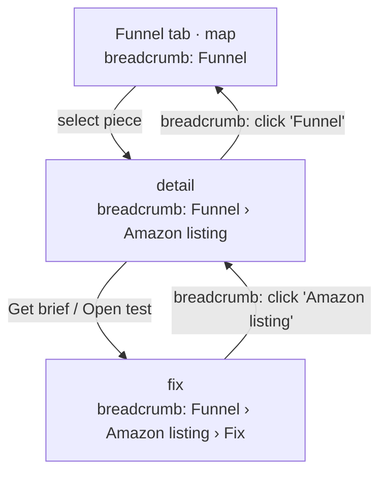
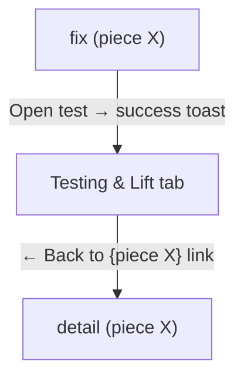
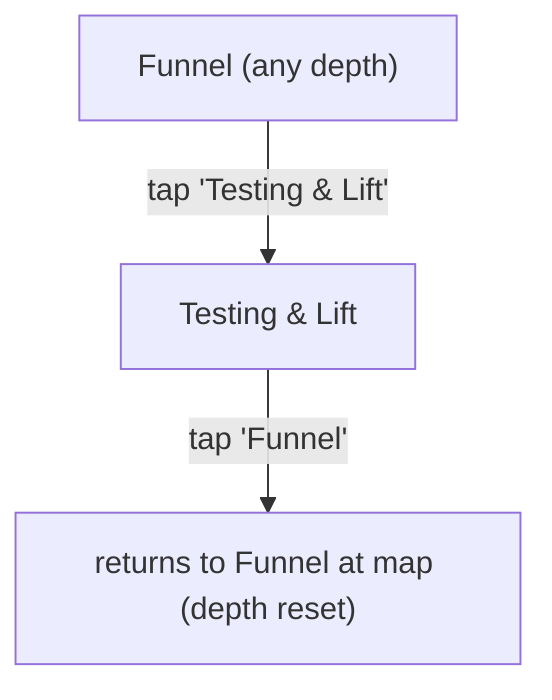
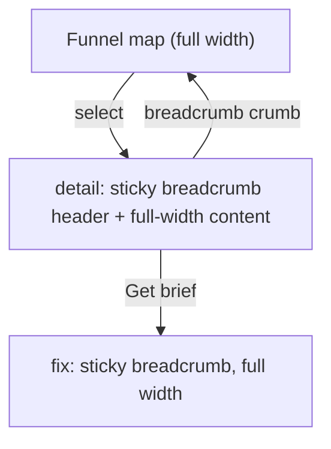

# UX Design Specification — Fix Stage Sub-Navigation

**Author:** Matthew
**Date:** 2026-06-28
**Focus:** Make the Fix stage's internal navigation (Funnel: map → detail → fix, and Testing & Lift)
legible — the one v4 stage with genuine 2nd-level hierarchy — WITHOUT adding a global two-level sidebar.

---

## Current state (grounded in `src/pages/v4/V4Fix.tsx`)

- Top sub-nav = **2 tabs**: **Funnel** (active for `map`/`detail`/`fix`) · **Testing & Lift** (`testing`).
- Inside "Funnel" the user descends **3 levels**: `map` (FunnelMap) → select a piece → `detail`
  (FunnelPieceDetail) → "Get brief / Open test" → `fix` (FixTestPanel).
- Depth is conveyed ONLY by in-view back buttons ("Back", "Back to piece"); the top tab still reads
  "Funnel" the whole way down, so mid-flow the user loses "where am I / how do I get back."
- `AddPieceDialog` is a modal reachable from map / "check an asset".

## The problem to solve

A user three levels into Funnel (fixing a piece) has no persistent signal of their location within
map → detail → fix, and the only way back is a single-step back button. This is the genuine hierarchy
that warrants better sub-navigation — but per Trevor's direction (simple surface, spine is the hero,
chrome subordinate) and the codebase evidence (only Fix has this depth; the v2 three-panel was
abandoned as too complex), the fix must be **stage-local and in-content**, never a second global rail.

## Discovery

**Core tension:** Fix has two kinds of navigation fighting in one bar — a **lateral switch**
(Funnel ↔ Testing & Lift, peers) and a **drill-down** (map → detail → fix, a path). Today both are a
single 2-tab row, so the drill-down depth is invisible.

**Direction:** keep the lateral switch as the top tabs; express the drill-down as a **breadcrumb**
inside the Funnel tab. Breadcrumb beats a second sidebar here because the path is shallow (3 levels),
linear, and piece-scoped — a persistent rail would waste the horizontal space the dense detail/fix
content needs and re-introduce the chrome Trevor called "daunting".

**Resolved discovery questions (stakeholder, 2026-06-28):**
1. **Breadcrumb shows the piece name** when drilled in — e.g. `Funnel › Amazon listing › Fix` — to
   reinforce "you're working on *this* piece."
2. **Testing & Lift links back to the worked piece** — after "Open test" jumps to Testing & Lift, a
   return affordance hops straight back to that piece's detail (not just the tab).
3. **Mobile:** detail/fix go **full-width with a sticky breadcrumb header**; the 2 top tabs collapse
   under the breadcrumb at `< md` so the dense content owns the 375px width.

**Fast-tracked (Steps 5–9):** no new visual language — reuse v23 tokens + shadcn `breadcrumb.tsx`,
`tabs`/`Button`, `card`. The sub-nav reads as part of the existing Fix surface.

## User Journey Flows

### Journey 1 — Drill down to fix a leaking piece

The breadcrumb is the back-control at every depth — each crumb is clickable, so the user jumps up any number of levels, not just one step.

### Journey 2 — Open a test, then return to the piece

After opening a test the user lands in Testing & Lift (current behavior) plus a "← Back to {piece}" affordance returns them to where they were — closing today's dead-end.

### Journey 3 — Lateral switch (peers)

Switching tabs is a context switch, so Funnel returns to `map` (clean slate) and selection state is cleared so no stale piece lingers.

### Journey 4 — Mobile (< md)

On mobile the breadcrumb header sticks; the 2 top tabs sit under it. Dense detail/fix content owns the 375px width (no side-by-side).

### Journey Patterns

- **Breadcrumb = the universal back-control** — replaces scattered single-step "Back"/"Back to piece" buttons with one consistent, multi-level trail.
- **Two nav types, two affordances** — lateral (tabs) vs. drill-down (breadcrumb); never conflated.
- **Selection is path state** — a selected piece exists only within the Funnel drill-down; leaving Funnel clears it (no stale context).

### Flow Optimization Principles

- Any depth → top in one tap (click the first crumb).
- No dead-ends: Testing & Lift always offers a route back to the worked piece.
- Tab switch = clean reset, so the user never returns to a half-drilled state they forgot.

## Component Strategy

### Design System (reused — no new primitives)

- **`breadcrumb.tsx`** (shadcn) — `Breadcrumb`, `BreadcrumbList`, `BreadcrumbItem`, `BreadcrumbLink`, `BreadcrumbPage`, `BreadcrumbSeparator`. The drill-down trail.
- **`Button`** (existing 2-tab row) — keep for the lateral Funnel ↔ Testing & Lift switch.
- lucide `MapIcon`, `FlaskConical`, `ChevronLeft` (already imported); `›` via `BreadcrumbSeparator`.

### Custom Components

#### `FixBreadcrumb` (new, small)

- **Purpose:** render the Funnel drill-down path; each ancestor crumb navigates up.
- **Props:** `view: 'map'|'detail'|'fix'`, `pieceLabel: string|null`, `onCrumb: (view) => void`.
- **Renders:** `map` → nothing (or just "Funnel"); `detail` → `Funnel › {pieceLabel}` (last = `BreadcrumbPage`); `fix` → `Funnel › {pieceLabel} › Fix`.
- **A11y:** `breadcrumb` gives `nav[aria-label]` + `aria-current="page"` on the leaf; crumbs are real buttons/links (keyboard + ≥44px).

#### Refactor `V4Fix.tsx` (the real work — no new state model)

- Keep the existing `view` state (`'map'|'detail'|'fix'|'testing'`) and `selectedPiece` — reuse as-is; this is presentation only.
- **Replace** the two scattered back buttons ("Back" in detail, "Back to piece" in fix) with `FixBreadcrumb` driven by `goTo(...)` + `clearSelection()`. Net: fewer ad-hoc controls.
- The **2 top tabs stay** (Funnel highlighted for map/detail/fix; Testing & Lift for testing) — unchanged lateral switch.
- **Tab switch resets to map:** tapping "Funnel" from Testing & Lift calls `clearSelection()` + `goTo('map')` (today it only `goTo('map')`).
- **Testing → piece return:** after `openTest` success, stash the worked `pieceId`; render a "← Back to {piece}" link in the Testing & Lift header that `selectPiece(id)` + `goTo('detail')`. (New lightweight `lastWorkedPieceRef`.)
- **Mobile:** wrap the breadcrumb row in a `sticky` header at `< md`; tabs sit beneath. Reuse the `top-12`/`md:top-0` offset convention from `SpineStepper`.

### Implementation Strategy

- Pure presentational/navigation refactor — no `useFixRun` / fixService changes, no data-model changes. Lowest-risk.
- Keep `v4_fix_view_changed`; optionally add `v4_fix_breadcrumb_used` (slug only) via the existing `emitPage` seam.
- Delete the now-orphaned inline back-button markup (clean up our own mess).

### Roadmap

- **Phase 1:** `FixBreadcrumb` + V4Fix refactor (breadcrumb replaces back buttons; tab-switch reset; Testing→piece return). Desktop + mobile sticky.
- **Phase 2 (optional):** if `AssetDetailTabs` (image-prompt / design-brief / check-asset) is later surfaced, it nests under detail as in-content tabs — the breadcrumb already supports a 4th crumb.

## UX Consistency Patterns

- **Two nav affordances, never merged:** lateral = tabs (peers); drill-down = breadcrumb (path). A user never has to guess which control moves them where.
- **Breadcrumb is the canonical "up":** retire one-off back buttons across Fix; every ancestor is a crumb. (Reusable for any future drill-down stage.)
- **Leaf = current, styled as `BreadcrumbPage`** (non-clickable, `aria-current`); ancestors are interactive.
- **Context-switch clears path state:** changing top tab resets the drill-down (no stale selection).
- **No dead-ends:** every terminal view (Testing & Lift) offers a route back to the worked piece.
- **Active-state source of truth:** the top tab's brand-highlight stays driven by `view` (Funnel for map/detail/fix), exactly as today — the breadcrumb adds depth signal without changing tab logic.

## Responsive & Accessibility

- **Breakpoint:** Tailwind `md` (768px) — same line the shell already switches on.
- **Desktop (≥ md):** tabs row + breadcrumb row both visible above the Fix content (~1100px column).
- **Mobile (< md):** sticky breadcrumb header (reuse `SpineStepper`'s `top-12`/`md:top-0` offset); tabs beneath; detail/fix full-width; **zero horizontal overflow at 375px** (hard rule); long piece names truncate in a crumb with full text in `title`.
- **A11y (WCAG 2.1 AA):** shadcn `breadcrumb` → `nav[aria-label="breadcrumb"]`, ordered list, `aria-current="page"` on leaf; crumbs keyboard-reachable, visible focus ring (v23 token), ≥44px targets; tab active retained; "← Back to {piece}" is a real link with discernible text.
- **Motion:** view changes honor `prefers-reduced-motion`.

## Implementation Summary (for the build)

1. New `src/components/v4/fix/FixBreadcrumb.tsx` (shadcn `breadcrumb`).
2. Refactor `src/pages/v4/V4Fix.tsx`: breadcrumb replaces the two inline back buttons; tab-switch → `clearSelection()`+`map`; `lastWorkedPieceRef` + "← Back to {piece}" in Testing & Lift; mobile sticky breadcrumb header.
3. No data/service changes. Tests: `FixBreadcrumb` unit (renders per-view crumbs, crumb click → `onCrumb`) + a V4Fix nav test (drill map→detail→fix→crumb-up; tab-switch resets; Testing→piece return).
4. Verify: `tsc`, `vitest`, build; browser walk at 375px + desktop (QA acct, `/fix` needs an avatar from Analyse).

---

## Workflow Status

**Complete** (2026-06-28). Created by the create-ux-design workflow (UX Designer "Sally"). Steps 1–2 +
10–14 authored collaboratively; Steps 5–9 fast-tracked (reuse existing v23 + shadcn system).

**Decision recorded:** NO global two-level sidebar. Fix's genuine 2nd-level hierarchy is solved
**stage-locally** with a clickable breadcrumb (map → piece → Fix) + the unchanged 2-tab lateral switch,
keeping the spine the hero and chrome subordinate (Trevor's direction). Build is a presentation-only
refactor of `V4Fix.tsx` + a small `FixBreadcrumb` component — no data/service changes.

<!-- Step 14 (complete). Workflow finished 2026-06-28. -->

