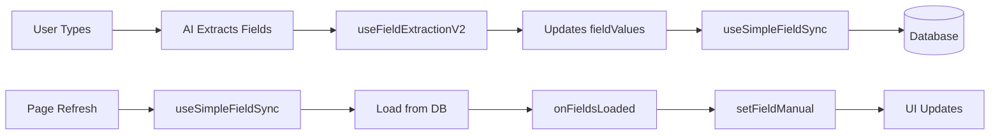

# Integration Instructions - Single Avatar Field Sync

## Quick Integration (5 minutes)

### Step 1: Add Import
In `src/pages/v2/BrandCoachV2.tsx`, add this import after line 19:

```typescript
import { useSimpleFieldSync } from '@/hooks/useSimpleFieldSync';
```

### Step 2: Add Hook Usage
After the `useFieldExtractionV2` hook (around line 116), add:

```typescript
// Sync fields to database for persistence
const { savedFieldCount } = useSimpleFieldSync({
  avatarId: currentAvatar?.id || null,
  fieldValues,
  fieldSources,
  onFieldsLoaded: (loadedFields) => {
    // Set loaded fields into the UI
    Object.entries(loadedFields).forEach(([fieldId, value]) => {
      setFieldManual(fieldId, value);
    });
  },
});
```

### Step 3: (Optional) Add Save Indicator
In the header section (around line 530), add a save status:

```typescript
{savedFieldCount > 0 && (
  <Badge variant="outline" className="text-xs">
    {savedFieldCount} fields saved
  </Badge>
)}
```

## That's It! 🎉

The hook will now:
1. **Load** existing fields from database on mount
2. **Save** fields automatically as they're extracted from chat
3. **Persist** manual edits immediately
4. **Migrate** any existing localStorage data

## How to Test

### Test 1: New User Flow
1. Sign up as new user
2. Start chatting: "My brand is TechStart and we make AI tools"
3. Watch console: `[FieldSync] ✓ Saved brand_name (ai)`
4. Check left panel: Fields should appear
5. Refresh page: Fields persist

### Test 2: Field Extraction
```
You: "We target developers aged 25-40 who love automation"
Console: [FieldSync] ✓ Saved target_audience (ai)
Console: [FieldSync] ✓ Saved age_range (ai)
```

### Test 3: Manual Edit
1. Click any field in left panel
2. Edit the value
3. Click outside field
4. Console: `[FieldSync] ✓ Saved [field] (manual)`
5. Refresh: Edit persists

## Verify in Database

```sql
-- Check your fields in Supabase SQL Editor
SELECT field_id, field_value, field_source, updated_at
FROM avatar_field_values
WHERE avatar_id IN (
  SELECT id FROM avatars WHERE user_id = auth.uid()
)
ORDER BY updated_at DESC
LIMIT 20;
```

## Console Output Examples

### Successful Flow:
```
[FieldSync] Loading existing fields from database...
[FieldSync] Loaded 5 fields from database
[FieldSync] ✓ Saved brand_name (ai)
[FieldSync] ✓ Saved target_audience (ai)
[FieldSync] ✓ Saved value_proposition (manual)
[FieldSync] Status: 7 fields saved, 7 fields in UI
```

### First Time User:
```
[FieldSync] Loading existing fields from database...
[FieldSync] No existing fields found
[FieldSync] Migrated 3 fields from localStorage
[FieldSync] ✓ Saved brand_name (ai)
```

## Troubleshooting

### Fields Not Saving?
1. Check avatar exists:
   ```sql
   SELECT * FROM avatars WHERE user_id = auth.uid();
   ```

2. Check console for errors:
   - Network errors → Check Supabase connection
   - Permission errors → Check RLS policies
   - No avatar ID → Check currentAvatar is set

### Fields Not Loading?
- Clear localStorage: `localStorage.clear()`
- Refresh page
- Check console for `[FieldSync] Loaded X fields`

### Too Many Save Calls?
The hook already debounces (500ms delay), but if still too many:
- Increase debounce in `useSimpleFieldSync.ts` line 135
- Change from 500 to 1000 or 2000 milliseconds

## What's Happening Under the Hood



## Performance Notes

- Fields save individually (not batched) for immediate persistence
- 500ms debounce prevents rapid re-saves
- localStorage migration happens once per user
- Database calls are optimized with upsert

## Next Steps (Optional Enhancements)

After confirming basic sync works:

1. **Visual Feedback**
   ```typescript
   {isSaving && <Spinner />}
   {lastSaved && <Text>Last saved: {lastSaved}</Text>}
   ```

2. **Error Recovery**
   ```typescript
   if (error) {
     // Queue for retry
     offlineQueue.push({ fieldId, value, source });
   }
   ```

3. **Batch Operations**
   ```typescript
   // Save multiple fields at once
   await fieldService.batchSaveFields({
     avatar_id: avatarId,
     fields: pendingFields,
   });
   ```

## Summary

✅ **Minimal change:** 2 imports, 1 hook call
✅ **Automatic:** No manual save needed
✅ **Reliable:** Database persistence
✅ **Compatible:** Works with existing code
✅ **Simple:** Single avatar focus

Fields will now persist properly during chat!