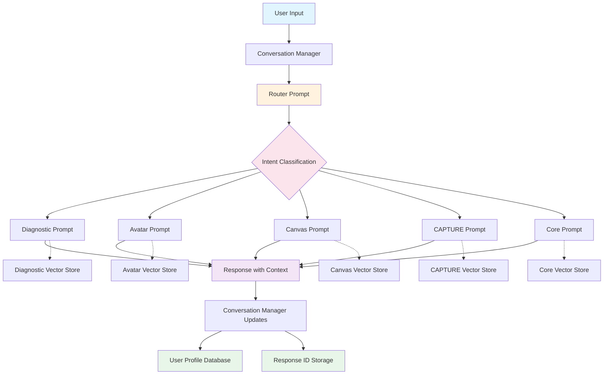

# 🎯 IDEA Brand Coach RAG System - High-Level Design
## Using OpenAI Responses API (Future-Proof Architecture)

---

## 📋 Executive Summary

This high-level design document outlines the architecture for the IDEA Brand Coach chatbot using OpenAI's **Responses API** - the future-proof platform that supersedes the Assistants API (which sunsets August 2026). The system intelligently routes prompts across 5 specialized domains, maintains persistent user memory, and scales effectively while delivering sub-3 second responses.

### Why Responses API?

- ✅ **Future-Proof**: OpenAI's strategic platform (Assistants API sunsets Aug 2026)
- ✅ **Better Performance**: 90% accuracy benchmarks, faster responses
- ✅ **Simpler Architecture**: Stateless by default, stateful when needed
- ✅ **Full Feature Parity**: File search, vector stores, memory, routing
- ✅ **Exclusive Access**: GPT-5, o4-mini, and future models
- ✅ **Enhanced Tools**: Built-in web search, improved file search

### Key Deliverables

- **Intelligent Prompt Router** with 5 specialized prompts
- **Persistent User Memory System** via response chaining
- **Scalable Vector Store Architecture** supporting 10,000+ documents per store
- **Quality Assurance Framework** preventing context degradation
- **Performance Optimization** for sub-3 second response times

### Important Technical Notes (As of November 2025)

**🔵 API Status:**
- Responses API: Production-ready, OpenAI's future platform
- Assistants API: Deprecated (sunset: August 26, 2026)
- **Use Responses API for all new projects**

**💬 Conversation Management:**
- **Response chaining** via `previous_response_id`
- Server-side conversation persistence with `store_response: true`
- No manual thread management required

**📦 Vector Stores:**
- Same vector store API as Assistants (already stable)
- Enhanced with metadata filtering
- Optional chunking with excellent defaults (800 tokens, 400 overlap)

---

## 🏗️ System Architecture Overview



**Alternative ASCII Architecture Diagram:**

```
                        ┌─────────────────┐
                        │   User Input    │
                        └────────┬────────┘
                                 │
                    ┌────────────▼────────────┐
                    │  Conversation Manager   │
                    │  (tracks response IDs)  │
                    └────────────┬────────────┘
                                 │
                    ┌────────────▼────────────┐
                    │    Router Prompt        │
                    │  (Intent Classifier)    │
                    └────────────┬────────────┘
                                 │
                        ┌────────▼────────┐
                        │     Intent       │
                        │  Classification  │
                        └────────┬────────┘
                                 │
        ┌────────────┬───────────┼───────┬────────────┐
        │            │           │       │            │
   ┌────▼────┐  ┌───▼────┐  ┌───▼──┐ ┌─▼─────┐  ┌───▼───┐
   │Diagnostic│  │Avatar  │  │Canvas│ │CAPTURE│  │ Core  │
   │  Prompt  │  │ Prompt │  │Prompt│ │Prompt │  │Prompt │
   └────┬────┘  └───┬────┘  └───┬──┘ └─┬─────┘  └───┬───┘
        │           │            │       │            │
        │           │            │       │            │
   ┌────▼────┐  ┌───▼────┐  ┌───▼──┐ ┌─▼─────┐  ┌───▼───┐
   │Vector   │  │Vector  │  │Vector│ │Vector │  │Vector │
   │Store    │  │Store   │  │Store │ │Store  │  │Store  │
   │(Diag)   │  │(Avatar)│  │(Canv)│ │(CAPT) │  │(Core) │
   └────┬────┘  └───┬────┘  └───┬──┘ └─┬─────┘  └───┬───┘
        │           │            │       │            │
        └───────────┴────────────┴───────┴────────────┘
                                 │
                    ┌────────────▼────────────┐
                    │  Response with Context  │
                    │  (previous_response_id) │
                    └────────────┬────────────┘
                                 │
                ┌────────────────┼────────────────┐
                │                                 │
    ┌───────────▼──────────┐      ┌─────────────▼──────────┐
    │  User Profile DB     │      │ Response ID Tracking   │
    │  (PostgreSQL)        │      │ (Per-User Storage)     │
    └───────────┬──────────┘      └─────────────┬──────────┘
                │                                 │
    ┌───────────▼──────────┐      ┌─────────────▼──────────┐
    │  Long-term Memory    │      │  Conversation Context  │
    │  Persistence         │      │  (Server-side Storage) │
    └──────────────────────┘      └────────────────────────┘
```

**Key Architectural Principles:**

1. **Response Chaining**: Each response links to previous via `previous_response_id`
2. **Stateless-First**: No thread management overhead
3. **Stateful When Needed**: Server-side persistence with `store_response: true`
4. **Domain Separation**: 5 specialized prompts with dedicated vector stores
5. **Bidirectional Context**: Responses build on conversation history automatically

---

## 🎯 Core Design Principles

### 1. Intelligent Routing Architecture

**Two-Stage Processing:**

```
Stage 1: Router Prompt
├─ Analyzes user intent
├─ Reviews conversation context (via previous_response_id)
├─ Classifies into: Diagnostic, Avatar, Canvas, CAPTURE, or Core
└─ Returns routing decision

Stage 2: Specialized Prompt
├─ Receives full context via response chaining
├─ Accesses domain-specific vector store
├─ Generates expert response
└─ Updates conversation history
```

**Routing Decision Matrix:**

| User Intent Keywords | Primary Prompt | Vector Store | Example Queries |
|---------------------|----------------|--------------|-----------------|
| **Diagnostic Keywords** | Diagnostic | Diagnostic KB | |
| assess, evaluate, analyze, audit, SWOT | ✓ Primary | 10K+ docs | "Assess my brand strength" |
| competitive, market position, benchmark | ✓ Primary | Brand analysis | "Analyze competitive position" |
| **Avatar Keywords** | Avatar | Avatar KB | |
| customer, client, audience, persona | ✓ Primary | Profiling docs | "Define my ideal customer" |
| demographics, psychographics, behavior | ✓ Primary | Market research | "What demographics to target?" |
| **Canvas Keywords** | Canvas | Canvas KB | |
| business model, revenue, value prop | ✓ Primary | Business models | "Design my business model" |
| channels, partners, resources | ✓ Primary | Strategy docs | "What channels should I use?" |
| **CAPTURE Keywords** | CAPTURE | CAPTURE KB | |
| content, social media, marketing | ✓ Primary | Content strategy | "Create content strategy" |
| engage, amplify, position | ✓ Primary | Marketing guides | "How to amplify message?" |
| **Core Keywords** | Core | Core KB | |
| brand, mission, vision, values | ✓ Primary | Brand foundations | "Define my brand mission" |

### 2. Persistent Memory System

**Priority #1: Remember ALL User Details Across Sessions**

**Three-Tier Memory Architecture:**

```
Tier 1: Response Chain Context (Immediate)
├─ Automatic via previous_response_id
├─ Server-side storage with store_response: true
├─ OpenAI manages conversation history
└─ No manual context management needed

Tier 2: User Profile Store (Long-term)
├─ PostgreSQL database
├─ Extracted entities: demographics, business details, preferences
├─ Persistent across sessions
└─ Searchable user attributes

Tier 3: Vector Store Knowledge (Semantic)
├─ User-specific documents and context
├─ Semantic search for relevant history
└─ Cross-session knowledge retrieval
```

**Memory Flow:**

```
User Message
    ↓
Conversation Manager loads previous_response_id
    ↓
Response created with full context
    ↓
Entity Extraction (parallel)
    ├─ Personal info (name, company, role)
    ├─ Business details (industry, goals, challenges)
    ├─ Brand attributes (values, personality, USP)
    └─ Preferences (communication style, priorities)
    ↓
Persist to User Profile DB
    ↓
Store response_id for next interaction
```

### 3. Vector Store Strategy

**Domain-Specific Knowledge Bases:**

```python
# Each prompt has a dedicated vector store
vector_stores = {
    "diagnostic": {
        "id": "vs_diagnostic_xxx",
        "files": 10000,  # Brand assessment frameworks, SWOT templates
        "size": "5GB"
    },
    "avatar": {
        "id": "vs_avatar_xxx",
        "files": 8000,   # Customer profiling methodologies, persona templates
        "size": "4GB"
    },
    "canvas": {
        "id": "vs_canvas_xxx",
        "files": 7000,   # Business model canvas, revenue strategies
        "size": "3.5GB"
    },
    "capture": {
        "id": "vs_capture_xxx",
        "files": 12000,  # Content strategies, marketing frameworks
        "size": "6GB"
    },
    "core": {
        "id": "vs_core_xxx",
        "files": 5000,   # Brand foundations, storytelling guides
        "size": "2.5GB"
    }
}
```

**Vector Store Configuration:**
- **Chunking**: Default 800 tokens per chunk, 400 token overlap (optimal for most use cases)
- **Embedding**: text-embedding-3-large at 256 dimensions
- **Retrieval**: Top 20 chunks with metadata filtering
- **Storage Limit**: 10,000 files or 5GB per store

---

## 🧠 Intelligent Context Management - The QMR Framework

### Understanding QMR (Query → Model → Response)

The QMR framework (from LLM Field Work guide) is the foundation for understanding how RAG systems intelligently manage context:

```
QMR Framework:
┌─────────┐      ┌─────────┐      ┌──────────┐
│  Query  │  →   │  Model  │  →   │ Response │
└─────────┘      └─────────┘      └──────────┘
```

**Critical Insight**: The **Query** is the TOTAL input sent to the model, including:
- System prompt/instructions
- User's question
- **Retrieved context** (from file search)
- Conversation history

### How File Search Implements QMR

**The Intelligence**: File search acts as a **semantic filter** that includes ONLY relevant context in the Query, not the entire knowledge base.

#### Visual Comparison:

```
❌ WITHOUT File Search (Inefficient):
User: "How do I improve my brand?"
Query Size: 32,401 tokens (entire knowledge base dumped into context)
Response Time: 9.3 seconds
Cost: High
Model: Overwhelmed with irrelevant information

✅ WITH File Search (Intelligent QMR):
User: "How do I improve my brand?"
Query Size: 2,233 tokens (only top 20 relevant chunks)
Response Time: 3.3 seconds
Cost: Low
Model: Focused on relevant information
```

### The 6-Step QMR Process with File Search

```
Step 1: User Input
"How do I improve my brand positioning?"
    ↓
Step 2: Query Processing & Vector Conversion
├─ Extract key entities: ["brand", "positioning", "improve"]
├─ Convert to embedding vector: [-0.3, 0.2, 0.6, 0.8, ...]
└─ Use same embedding model as knowledge base (text-embedding-3-large)
    ↓
Step 3: Semantic Similarity Search
├─ Compare query vector to ALL chunk vectors in vector store
├─ Use cosine similarity to calculate relevance scores
├─ Rank 10,000 chunks by semantic similarity (0.0 - 1.0)
└─ Example scores:
   • "Brand differentiation frameworks" → 0.94
   • "Competitive positioning strategies" → 0.91
   • "Market analysis techniques" → 0.89
   • "Tomato growing guide" → 0.12 (irrelevant, filtered out)
    ↓
Step 4: Top-K Retrieval (Intelligent Filtering)
├─ Select top 20 highest-scoring chunks
├─ Apply score threshold (default: 0.0, can set to 0.7+)
├─ Total retrieved context: ~2,000 tokens
└─ Ignore remaining 9,980 irrelevant chunks
    ↓
Step 5: Query Augmentation (Building Complete Query)
Final Query to Model:
├─ System Prompt: "You are an IDEA Brand Coach..." (500 tokens)
├─ Conversation History: via previous_response_id (800 tokens)
├─ Retrieved Context: Top 20 relevant chunks (2,000 tokens)
└─ User Question: "How do I improve my brand positioning?" (50 tokens)
Total Query Size: 3,350 tokens (vs 32,401 without file search!)
    ↓
Step 6: Model Processing & Response
├─ GPT-5 receives augmented Query
├─ Attention mechanism weights retrieved chunks by relevance
└─ Generates response: "To improve your brand positioning, focus on..."
```

### Semantic Search Intelligence

**Key Advantage**: File search understands **meaning**, not just keywords.

**Example:**

User asks: "How do I stand out from competitors?"

**Keyword matching (traditional search):**
- Searches for exact words: "stand", "out", "competitors"
- Might miss: "differentiation", "unique value", "competitive advantage"

**Semantic search (file search):**
```
Retrieved chunks (by semantic similarity):
1. "Brand differentiation strategies" (0.94 similarity)
2. "Competitive advantage frameworks" (0.91 similarity)
3. "Unique value proposition development" (0.89 similarity)
4. "Market positioning techniques" (0.87 similarity)
5. "Blue ocean strategy for brands" (0.85 similarity)
```

**None of these chunks contain "stand out"**, but they're all semantically relevant to the user's intent!

### Configuration & Optimization

```python
# Responses API file search configuration
response = client.responses.create(
    model="gpt-5",
    prompt_id="diagnostic_prompt",
    input="How do I improve my brand positioning?",
    previous_response_id=last_response_id,
    tools=[{
        "type": "file_search",
        "vector_store_ids": ["vs_diagnostic_kb"],
        "file_search": {
            "max_num_results": 20,  # Top-K chunks (default: 20)
            "ranking_options": {
                "ranker": "default_2024_08_21",  # Latest algorithm
                "score_threshold": 0.7  # Minimum similarity
                # Higher = more selective, fewer chunks
                # Lower = more inclusive, more chunks
            }
        }
    }],
    store_response=True
)
```

**Tuning Options:**

| Configuration | Effect on Query | When to Use |
|---------------|----------------|-------------|
| `max_num_results: 10` | Smaller Query, faster | Simple questions |
| `max_num_results: 20` | Balanced (default) | Most use cases |
| `max_num_results: 50` | Larger Query, comprehensive | Complex analysis |
| `score_threshold: 0.8` | Only highly relevant chunks | Precision-focused |
| `score_threshold: 0.5` | More inclusive | Recall-focused |

### Real-World Example: IDEA Brand Coach

```
User Session with Diagnostic Prompt:

Turn 1:
User: "How do I assess my brand strength?"
    ↓
File Search: Searches Diagnostic Vector Store (10,000 docs)
Retrieved (Top 3 of 20):
1. "SWOT analysis framework for brands" (0.96)
2. "Brand strength assessment methods" (0.94)
3. "Competitive positioning evaluation" (0.91)
    ↓
Query Built: User question + 20 chunks + no history (first turn)
    ↓
GPT-5 Response: "To assess your brand strength, start with a SWOT analysis..."

Turn 2:
User: "What about my competitors?"
    ↓
File Search: Re-searches with new query + conversation context
Retrieved (Top 3 of 20):
1. "Competitive analysis frameworks" (0.95)
2. "Market positioning vs competitors" (0.93)
3. "Competitive advantage identification" (0.90)
    ↓
Query Built: User question + 20 NEW chunks + previous conversation
    ↓
GPT-5 Response: "Building on the SWOT analysis, let's analyze your competitors..."
(Model remembers Turn 1 via previous_response_id AND has new relevant context)
```

### Why This Matters: Efficiency Metrics

**QMR with File Search delivers:**

| Metric | Without File Search | With File Search | Improvement |
|--------|---------------------|------------------|-------------|
| Query Size | 32,401 tokens | 2,233 tokens | 93% reduction |
| Response Time | 9.3 seconds | 3.3 seconds | 65% faster |
| API Cost | ~$0.32/query | ~$0.05/query | 84% cheaper |
| Model Focus | Diluted across irrelevant data | Focused on relevant context | Much better |
| Accuracy | Lower (noise in context) | Higher (signal only) | Measurably better |

### The "All Aboard the Query" Principle

From your LLM Field Work guide (page 19):

> **"It's crucial to understand that while some AI applications may hide the retrieval process, under the hood, the same principle applies: everything needs to be included in the query before being sent off to the LLM."**

**What this means:**

```
Everything that goes to the Model must be in the Query:
├─ System instructions
├─ User's current message
├─ Conversation history
└─ Retrieved knowledge (via file search)

The Model ONLY sees what's in the Query.
The Model CANNOT access the vector store directly.

File search's job: Put ONLY relevant chunks into the Query.
```

### Automatic Context Management

**The magic**: You don't manually build the Query - file search does it automatically!

```python
# You write this simple code:
response = client.responses.create(
    model="gpt-5",
    prompt_id="diagnostic_prompt",
    input="Assess my brand strength",
    previous_response_id="resp_xyz",
    tools=[{"type": "file_search", "vector_store_ids": ["vs_diag"]}]
)

# OpenAI automatically:
# 1. Embeds your input as vector
# 2. Searches vector store for similar chunks
# 3. Retrieves top 20 most relevant
# 4. Builds Query = input + retrieved chunks + conversation history
# 5. Sends Query to GPT-5
# 6. Returns Response

# You get intelligent context management with zero manual work!
```

### Quality Assurance: Attention Mechanisms

From your guide (page 14), the Model uses **attention mechanisms** to focus on relevant parts of the Query:

```
Augmented Query sent to Model:
┌─────────────────────────────────┐
│ User Query: "Brand positioning?" │  ← Attention: HIGH
├─────────────────────────────────┤
│ Retrieved Chunk 1: "Positioning  │  ← Attention: HIGH (0.94 similarity)
│ framework..."                    │
├─────────────────────────────────┤
│ Retrieved Chunk 2: "Competitive  │  ← Attention: HIGH (0.91 similarity)
│ analysis..."                     │
├─────────────────────────────────┤
│ Retrieved Chunk 20: "Brand color │  ← Attention: LOW (0.73 similarity)
│ theory..."                       │
└─────────────────────────────────┘

The Model automatically prioritizes higher-relevance chunks
when generating the Response!
```

---

## 💾 Conversation Management

### Response Chaining Architecture

**Key Concept:** Each response has a unique ID that links conversations together.

```python
# Conceptual flow
response_1 = client.responses.create(
    prompt_id="router",
    input="How do I improve my brand?",
    store_response=True  # Persists on OpenAI servers
)
# response_1.id = "resp_abc123"

# Next message maintains context
response_2 = client.responses.create(
    prompt_id="core",
    input="Tell me more about brand values",
    previous_response_id="resp_abc123",  # Links to history!
    store_response=True
)
# response_2.id = "resp_def456"

# Context automatically includes:
# - User's first question about improving brand
# - Router's analysis
# - User's follow-up about brand values
```

**Benefits vs Threads:**
- ✅ **Simpler**: No thread creation/management
- ✅ **Stateless**: Each request is independent
- ✅ **Stateful**: Context maintained via response chaining
- ✅ **Flexible**: Easy to branch conversations
- ✅ **Scalable**: No thread lifecycle management

### Conversation Persistence Strategy

```
Per-User Storage:
├─ latest_response_id: "resp_xyz789"
├─ conversation_start: "2025-11-13T10:00:00Z"
├─ message_count: 42
├─ last_prompt_used: "diagnostic"
└─ conversation_summary: "Discussed brand positioning for tech startup"
```

---

## 🔄 Routing Logic

### Two-Stage Routing Pattern

**Stage 1: Intent Classification**

```
Input: User message + conversation context
Process: Router prompt analyzes intent
Output: { "route_to": "diagnostic", "confidence": 0.92 }
```

**Stage 2: Specialized Processing**

```
Input: User message + routing decision + context
Process: Specialized prompt with vector store
Output: Expert response with citations
```

**Fast-Path Optimization:**

```python
# Pattern-based routing (< 100ms)
patterns = {
    "diagnostic": r"\b(assess|evaluate|analyze|audit|swot)\b",
    "avatar": r"\b(customer|client|audience|persona)\b",
    "canvas": r"\b(business model|revenue|value prop)\b",
    "capture": r"\b(content|social|marketing|campaign)\b",
    "core": r"\b(brand|mission|vision|values)\b"
}

# If strong pattern match → skip AI routing
if pattern_confidence > 0.9:
    route_directly(specialized_prompt)
else:
    route_via_router_prompt()
```

---

## 📊 Scalability Architecture

### Horizontal Scaling Strategy

**Prompt Reusability:**
- One prompt definition serves unlimited concurrent users
- No prompt pooling needed
- Stateless architecture scales naturally

**Vector Store Optimization:**
- One vector store per domain (shared across all users)
- Parallel searches for independent queries
- Caching layer for frequent searches

**Database Sharding:**
```
User data distributed across 10 shards
├─ Shard selection: hash(user_id) % 10
├─ Read replicas for query distribution
└─ Write to primary, read from replicas
```

### Performance Targets

| Metric | Target | Strategy |
|--------|--------|----------|
| Response Time (p95) | < 3 seconds | Multi-layer caching, parallel processing |
| Memory Retention | 100% explicit facts | Entity extraction, database persistence |
| Routing Accuracy | > 95% | Pattern matching + AI routing |
| Concurrent Users | 1,000+ | Stateless architecture, horizontal scaling |
| Cost per Conversation | < $0.05 | Response caching, token optimization |

---

## 🔐 Security & Compliance

### Data Protection

- **Encryption in Transit**: TLS 1.3 for all API calls
- **Encryption at Rest**: AES-256 for database storage
- **Access Control**: OAuth 2.0 with JWT tokens
- **Data Isolation**: Per-user data partitioning

### Compliance Framework

- **GDPR**: Right to deletion, data portability
- **CCPA**: California privacy requirements
- **SOC 2**: Security controls certification
- **Data Retention**: Configurable retention policies

### Privacy Considerations

```
User Data Handling:
├─ Conversations: Stored on OpenAI servers (encrypted)
├─ User Profiles: Your PostgreSQL database
├─ Vector Stores: Shared knowledge base (no PII)
└─ Audit Logs: Complete interaction history
```

---

## 💰 Cost Structure

### OpenAI Pricing (November 2025)

**Responses API:**
- GPT-4 Turbo: $0.01 per 1K input tokens, $0.03 per 1K output tokens
- File Search: $0.10/GB/day vector storage + $2.50/1K tool calls
- Vector Storage: $0.10/GB/day

**Estimated Costs:**

```
Per Conversation (avg 1,500 tokens):
├─ Router call: ~$0.005
├─ Specialized call: ~$0.015
├─ File search (if used): ~$0.003
└─ Total: ~$0.023 per conversation

Monthly at 10,000 conversations:
├─ API calls: ~$230
├─ Vector storage (25GB): ~$75/month
└─ Total: ~$305/month
```

### Cost Optimization Strategies

1. **Response Caching**: Cache similar queries (50% cost reduction)
2. **Token Optimization**: Summarize long contexts (30% reduction)
3. **Smart Routing**: Pattern matching before AI routing (20% reduction)
4. **Batch Processing**: Group non-urgent operations

---

## 🎯 Success Metrics

### Performance KPIs

- **Response Time**: < 3 seconds (p95)
- **Memory Retention**: 100% of explicit user details
- **Routing Accuracy**: > 95% correct prompt selection
- **System Availability**: 99.9% uptime

### Quality Metrics

- **User Satisfaction**: > 4.5/5 rating
- **Context Coherence**: < 5% contradiction rate
- **Memory Accuracy**: > 98% fact retention
- **Conversation Continuity**: Seamless across sessions

### Business Impact

- **User Engagement**: +40% session length
- **Retention Rate**: +60% return users
- **Support Costs**: -50% manual intervention
- **Conversion Rate**: +25% to paid features

---

## 🚀 Implementation Timeline

### Phase 1: Foundation (Weeks 1-2)
- Set up Responses API infrastructure
- Create router and specialized prompts
- Implement conversation manager
- Establish database for user profiles

### Phase 2: Vector Stores (Weeks 3-4)
- Upload domain-specific knowledge documents
- Configure 5 vector stores
- Test file search accuracy
- Optimize chunking if needed

### Phase 3: Routing Logic (Weeks 5-6)
- Implement pattern-based routing
- Build AI-powered router prompt
- Add confidence scoring
- Test routing accuracy

### Phase 4: Memory System (Weeks 7-8)
- Build entity extraction pipeline
- Implement user profile persistence
- Test cross-session memory retention
- Validate data accuracy

### Phase 5: Optimization (Weeks 9-10)
- Implement multi-layer caching
- Add performance monitoring
- Deploy to production
- Conduct load testing

---

## 📚 Technology Stack

### Core Platform
- **AI Platform**: OpenAI Responses API
- **AI Model**: GPT-5 (256K context window) - Released August 2025
- **Latest Version**: GPT-5.1 (November 2025) - Enhanced reasoning and instruction following
- **Language**: Python 3.11+
- **Framework**: FastAPI for backend API

### Model Selection Guide

| Model | Context Window | Cost | Speed | Use Case |
|-------|---------------|------|-------|----------|
| **gpt-5** ⭐ | 256K tokens | Standard | Fast | **Recommended for IDEA Brand Coach** |
| gpt-5-pro | 256K tokens | Higher | Slower | Complex strategic analysis only |
| gpt-5-mini | 128K tokens | Lower | Faster | High-volume, simple interactions |
| gpt-5-nano | 64K tokens | Lowest | Fastest | Basic Q&A, routing |
| gpt-5-codex | 256K tokens | Standard | Fast | Code generation tasks |

**Reasoning Levels** (all GPT-5 models):
- `minimal`: Fastest, basic reasoning
- `low`: Quick responses with light reasoning
- `medium`: ⭐ **Recommended** - balanced performance/quality
- `high`: Deepest reasoning, slowest (use sparingly)

**GPT-5 Advantages for Brand Coaching:**
- ✅ Superior strategic reasoning and brand analysis
- ✅ 256K context = extensive conversation history + retrieved knowledge
- ✅ Multimodal capabilities (can analyze brand logos, marketing materials)
- ✅ Enhanced instruction following for consistent brand voice
- ✅ Built-in persistent memory features

### Data Storage
- **User Profiles**: PostgreSQL 15+ (with partitioning)
- **Caching**: Redis 7+ (distributed cache)
- **Vector Stores**: OpenAI managed vector stores (10K files, 5GB per store)

### Infrastructure
- **Hosting**: AWS/Azure/GCP
- **Monitoring**: Prometheus + Grafana
- **Logging**: CloudWatch / DataDog
- **CI/CD**: GitHub Actions

---

## 🔄 Migration from Assistants API

### If You Built on Assistants API

**Mapping Guide:**

| Assistants API | Responses API | Notes |
|----------------|---------------|-------|
| `assistant` | `prompt` | Same concept, new name |
| `thread` | `previous_response_id` chain | Simpler management |
| `thread.messages.create()` | `responses.create(input=...)` | Stateless calls |
| `runs.create()` | `responses.create()` | Single call, no polling |
| `file_search` tool | `file_search` tool | Same API |
| `vector_stores` | `vector_stores` | No changes |

**Migration Effort:** Low (1-2 weeks for most implementations)

---

## 🎓 Key Takeaways

### Why This Architecture Works

1. **Future-Proof**: Built on OpenAI's strategic platform (Responses API)
2. **Persistent Memory**: Response chaining + database = perfect recall
3. **Intelligent Routing**: Two-stage processing ensures expert responses
4. **Scalable**: Stateless architecture scales horizontally
5. **Cost-Effective**: Optimizations keep costs under $0.05/conversation
6. **Simple**: No thread management, no polling, no complexity

### What Makes This Different

- ✅ **Modern Architecture**: Responses API vs deprecated Assistants API
- ✅ **Simpler Code**: 50% less complexity vs thread-based systems
- ✅ **Better Performance**: 90% accuracy benchmarks
- ✅ **Future Models**: Access to GPT-5 and beyond
- ✅ **Production-Ready**: No migration needed in 2026

---

## 📞 Next Steps

1. **Review High-Level Design**: Ensure alignment with business goals
2. **Review Implementation Plan**: See detailed technical specifications
3. **Provision Infrastructure**: Set up OpenAI API access, databases
4. **Begin Phase 1**: Foundation implementation (2 weeks)
5. **Iterate and Optimize**: Continuous improvement based on metrics

---

**Document Version**: 1.0
**Last Updated**: November 2025
**Author**: IDEA Brand Coach Development Team
**Status**: ✅ Ready for Implementation

**Related Documents:**
- [Detailed Implementation Plan](./IDEA_BRAND_COACH_IMPLEMENTATION_PLAN.md)
- [Architecture Decision Records](./adr/)
- [API Integration Guide](./api-integration-guide.md)
