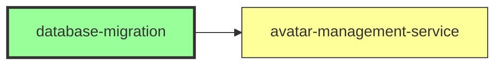
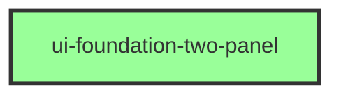
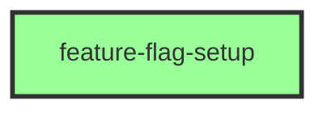
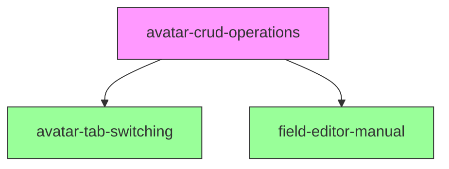
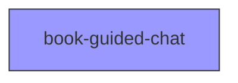
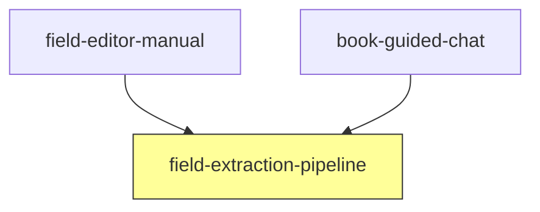
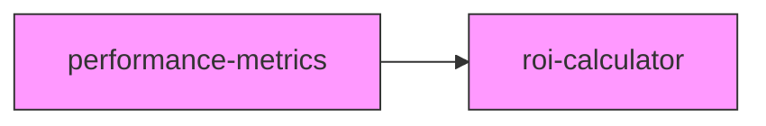
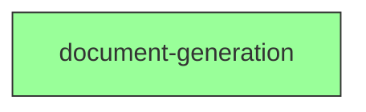
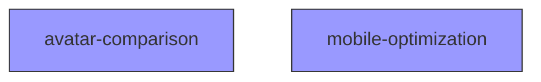
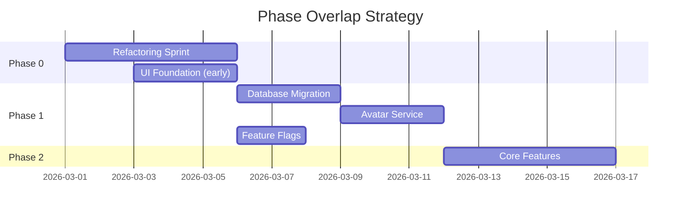

# IDEA Brand Coach V2 - Parallel Execution Plan

## ⚠️ UPDATED: Aligned with PRD (Two-Panel Design, Multi-Avatar System)

This plan has been updated to match the February 28, 2026 PRD specifications:
- **Two-panel layout** (not three-panel)
- **Single brand with multiple avatars** (not multiple brands)
- **Book-guided chat workflow**
- **Manual field editing priority**

## 🏃‍♂️ START THESE THREE NOW - No Dependencies!

| What You'll See in Auto-Claude | Command | Time |
|--------------------------------|---------|------|
| **"Multi-Avatar Database Schema"** | `auto-claude --feature database-migration` | 3 days |
| **"Two-Panel Responsive UI Foundation"** | `auto-claude --feature ui-foundation-two-panel` | 4 days |
| **"Feature Flag Configuration"** | `auto-claude --feature feature-flag-setup` | 2 days |

All three can run in parallel worktrees starting TODAY!

## Quick Start Commands

```bash
# Navigate to repository
cd /Users/matthewkerns/workspace/ecommerce-tools/brand-systems/idea-brand-coach
git checkout main-v2

# Phase 0: Refactoring Sprint (Week 1) - SEQUENTIAL
npm run analyze:all                    # Assessment
npm run refactor:services              # Refactor services
npm run refactor:components            # Refactor components
npm run test:coverage                  # Verify 70% coverage

# Phase 1: Foundation (Weeks 2-3) - PARALLEL TRACKS
# Can run these simultaneously in different terminals:
npm run dev:track-a                    # Database & Backend Services
npm run dev:track-b                    # Frontend Foundation
npm run dev:track-c                    # Infrastructure

# Phase 2-5: Follow roadmap features
```

## Repository Information
- **Path:** `/Users/matthewkerns/workspace/ecommerce-tools/brand-systems/idea-brand-coach`
- **Branch:** `main-v2`
- **Implementation Directory:** `/src/v2/`
- **Roadmap:** `/.auto-claude/roadmap/roadmap.json` (aligned with PRD)
- **PRD:** `/Users/matthewkerns/workspace/ai-agency-development-os/claude-code-os-implementation/02-operations/project-management/active-projects/idea-brand-coach/v2-02-28/prd.md`

---

## 🚀 Parallel Implementation Strategy After Refactoring Sprint

Based on the roadmap analysis, here's the optimal parallel execution plan:

## Phase 0: Refactoring Sprint (Week 1) - SEQUENTIAL

**Must complete before starting parallel tracks**

### Critical Refactorings Required
1. **SupabaseChatService.ts** - Extract methods, reduce complexity
2. **AIAssistant.tsx** - Split into smaller components
3. **usePersistedField.ts** - Add type safety
4. **fieldSync.ts** - Extract shared service
5. **Test coverage** - Achieve 70% on critical paths

### Success Criteria
- [ ] Complexity reduced by 30%
- [ ] Test coverage ≥70%
- [ ] No functions >50 lines
- [ ] No components >150 lines
- [ ] All tests passing

---

## 🚀 START NOW: Immediate Parallel Execution (No Need to Wait!)

These roadmap items can start TODAY in parallel worktrees:

### Track A: Database & Backend Services
**Developer Profile:** Backend/Database Specialist
**Worktree:** `feature/v2-database`



1. **"Multi-Avatar Database Schema"** (3 days) ✅ START NOW
   - Roadmap ID: `database-migration`
   - Title: **Multi-Avatar Database Schema**
   - No dependencies - completely independent!
   - Create brands, avatars, performance_metrics tables
   - Implement RLS policies
   - ⚠️ Critical path - unlocks avatar-management-service

2. **"Avatar Management Service Layer"** (3 days)
   - Roadmap ID: `avatar-management-service`
   - Title: **Avatar Management Service Layer**
   - Dependencies: [`database-migration`] only
   - Can start Day 3-4
   - ⚠️ Biggest bottleneck - unlocks 5+ features

### Track B: Frontend Foundation
**Developer Profile:** Frontend/UI Specialist
**Worktree:** `feature/v2-ui`



1. **"Two-Panel Responsive UI Foundation"** (4 days) ✅ START NOW
   - Roadmap ID: `ui-foundation-two-panel`
   - Title: **Two-Panel Responsive UI Foundation**
   - No dependencies - completely independent!
   - Two-panel responsive layout
   - Mobile bottom sheet
   - Collapsible panels

### Track C: Infrastructure
**Developer Profile:** Full-Stack Developer
**Worktree:** `feature/v2-infrastructure`



1. **"Feature Flag Configuration"** (2 days) ✅ START NOW
   - Roadmap ID: `feature-flag-setup`
   - Title: **Feature Flag Configuration**
   - No dependencies - completely independent!
   - Configure v2-multi-avatar flag
   - Set up admin UI

## 🎯 Phase 1 Can Run PARALLEL to Phase 0!

**Refactoring Sprint (Phase 0)** in main worktree:
- `tech-debt-cleanup`
- `test-coverage-improvement`

**Foundation (Phase 1)** in parallel worktrees:
- `database-migration` ✅ START NOW
- `ui-foundation-two-panel` ✅ START NOW
- `feature-flag-setup` ✅ START NOW
- `avatar-management-service` (after database)

---

## 📊 Phase 2: Core Multi-Avatar Features (Weeks 4-5) - PARALLEL EXPANSION

Once "Avatar Management Service Layer" is complete, expand to multiple parallel streams:

### Track A: Avatar Core Features
**Requires:** "Avatar Management Service Layer" + "Two-Panel Responsive UI Foundation"



**Roadmap Items:**
- **"Avatar CRUD Operations"** (`avatar-crud-operations`)
  - Dependencies: [`avatar-management-service`, `ui-foundation-two-panel`]
- **"Avatar Tab Navigation"** (`avatar-tab-switching`)
  - Dependencies: [`avatar-crud-operations`]
- **"Manual Field Editor with Sync"** (`field-editor-manual`)
  - Dependencies: [`avatar-crud-operations`]

### Track B: Chat System (Parallel!)
**Requires:** "Avatar Management Service Layer" only



**Roadmap Items:**
- **"Book-Guided Chat Workflow"** (`book-guided-chat`)
  - Dependencies: [`avatar-management-service`]
  - ✅ Can run completely parallel to Track A!

### Track C: Convergence Point
**Requires:** BOTH Track A + Track B completion



**Roadmap Items:**
- **"AI Field Extraction from Chat"** (`field-extraction-pipeline`)
  - Dependencies: [`book-guided-chat`, `field-editor-manual`]
  - ⚠️ Must wait for both tracks to complete

---

## 🎯 Phase 3: Advanced Features (Weeks 6-7) - MAXIMUM PARALLELIZATION

Three independent tracks with no interdependencies:

### Track A: Analytics


### Track B: Content Generation


### Track C: UX Enhancements


---

## 💡 Key Optimization Strategies

### 1. Start UI Foundation Early
Since `ui-foundation-two-panel` has no dependencies, consider starting it during the refactoring sprint if you have capacity.

### 2. Fast-track Database Path
The database → service layer is your critical path. Prioritize this to unblock the most features.

### 3. Optimal Resource Allocation

| Developer | Specialization | Track Assignment | Critical Tasks |
|-----------|---------------|------------------|----------------|
| Dev 1 | Backend/Database | Track A | database-migration, avatar-management-service |
| Dev 2 | Frontend/UI | Track B | ui-foundation-two-panel, field-editor-manual |
| Dev 3 | Full-Stack | Track C → Support | feature-flags, then support critical path |

### 4. Bottleneck Management

**Critical Bottlenecks:**
1. `avatar-management-service` - blocks 5+ features
2. `avatar-crud-operations` - second convergence point
3. `field-extraction-pipeline` - requires two tracks

**Mitigation:**
- Allocate best resources to bottleneck tasks
- Plan integration checkpoints when tracks merge
- Have Dev 3 ready to support bottlenecks

### 5. Phase Overlap Opportunities



---

## 🚦 Quick Start Execution Order

### Day 1 - Start All These in Parallel:
```bash
# Terminal 1: "Multi-Avatar Database Schema"
auto-claude --feature database-migration

# Terminal 2: "Two-Panel Responsive UI Foundation"
auto-claude --feature ui-foundation-two-panel

# Terminal 3: "Feature Flag Configuration"
auto-claude --feature feature-flag-setup

# Terminal 4: "Pre-Implementation Refactoring Sprint" (optional, quality improvement)
auto-claude --feature tech-debt-cleanup
```

### Day 3-4 - After Database Migration:
```bash
# Terminal 1: "Avatar Management Service Layer"
auto-claude --feature avatar-management-service
```

### Week 2 - After Foundation Complete:
```bash
# "Avatar CRUD Operations"
auto-claude --feature avatar-crud-operations

# "Book-Guided Chat Workflow" (parallel with above)
auto-claude --feature book-guided-chat
```

## 📈 Timeline Impact with Roadmap Items

### Original Sequential Timeline: 10 weeks
### Parallel with Refactoring First: 8-9 weeks
### Aggressive Parallel (START NOW): 6-7 weeks ⚡

**Maximum Time Savings:** 3-4 weeks (30-40% reduction)

### Week-by-Week Breakdown

| Week | Phase | Parallel Tracks | Key Deliverables |
|------|-------|-----------------|------------------|
| 1 | Phase 0 | Sequential refactoring | Clean codebase, 70% test coverage |
| 2-3 | Phase 1 | 3 parallel tracks | Database, UI foundation, feature flags |
| 4-5 | Phase 2 | 2-3 parallel tracks | Avatar CRUD, chat system, field sync |
| 6-7 | Phase 3 | 3 parallel tracks | Analytics, documents, UX |
| 8 | Phase 4 | Testing convergence | Integration, E2E, security |
| 9 | Phase 5 | Beta preparation | Rollout, monitoring |

---

## 📋 Complete Roadmap Reference (ID + Title)

### Items You Can Start NOW (No Dependencies):
| Title | Roadmap ID | Duration | Worktree |
|-------|------------|----------|----------|
| **Multi-Avatar Database Schema** | `database-migration` | 3 days | feature/v2-database |
| **Two-Panel Responsive UI Foundation** | `ui-foundation-two-panel` | 4 days | feature/v2-ui |
| **Feature Flag Configuration** | `feature-flag-setup` | 2 days | feature/v2-infrastructure |

### Items Starting Soon (Minimal Dependencies):
| Title | Roadmap ID | Dependencies | Can Start |
|-------|------------|-------------|-----------|
| **Avatar Management Service Layer** | `avatar-management-service` | [`database-migration`] | Day 3-4 |
| **Pre-Implementation Refactoring Sprint** | `tech-debt-cleanup` | None (but affects quality) | Anytime |
| **Test Coverage Enhancement** | `test-coverage-improvement` | None | Anytime |

### Phase 2 Items (After Foundation):
| Title | Roadmap ID | Dependencies |
|-------|------------|-------------|
| **Avatar CRUD Operations** | `avatar-crud-operations` | [`avatar-management-service`, `ui-foundation-two-panel`] |
| **Book-Guided Chat Workflow** | `book-guided-chat` | [`avatar-management-service`] |
| **Avatar Tab Navigation** | `avatar-tab-switching` | [`avatar-crud-operations`] |
| **Manual Field Editor with Sync** | `field-editor-manual` | [`avatar-crud-operations`] |
| **AI Field Extraction from Chat** | `field-extraction-pipeline` | [`book-guided-chat`, `field-editor-manual`] |

### Phase 3 Items (Advanced Features):
| Title | Roadmap ID | Dependencies |
|-------|------------|-------------|
| **Performance Metrics Tracking** | `performance-metrics` | [`avatar-crud-operations`] |
| **ROI Calculation & Reporting** | `roi-calculator` | [`performance-metrics`] |
| **Strategy Document Generation** | `document-generation` | [`book-guided-chat`, `field-editor-manual`] |
| **Avatar Comparison View** | `avatar-comparison` | [`avatar-crud-operations`] |
| **Mobile Experience Optimization** | `mobile-optimization` | [`ui-foundation-two-panel`] |

## 🎬 Execution Commands with Titles & IDs

### Start NOW - Database Track (Worktree 1)
```bash
# Create worktree for database work
git worktree add -b feature/v2-database ../idea-coach-database

# Navigate to worktree
cd ../idea-coach-database

# Execute "Multi-Avatar Database Schema"
auto-claude --feature database-migration

# After completion, execute "Avatar Management Service Layer"
auto-claude --feature avatar-management-service
```

### Start NOW - UI Track (Worktree 2)
```bash
# Create worktree for UI work
git worktree add -b feature/v2-ui ../idea-coach-ui

# Navigate to worktree
cd ../idea-coach-ui

# Execute "Two-Panel Responsive UI Foundation"
auto-claude --feature ui-foundation-two-panel
```

### Start NOW - Infrastructure Track (Worktree 3)
```bash
# Create worktree for infrastructure
git worktree add -b feature/v2-infrastructure ../idea-coach-infra

# Navigate to worktree
cd ../idea-coach-infra

# Execute "Feature Flag Configuration"
auto-claude --feature feature-flag-setup
```

### Meanwhile - Refactoring (Main Worktree)
```bash
# Stay in main repository
cd /Users/matthewkerns/workspace/ecommerce-tools/brand-systems/idea-brand-coach

# Execute "Pre-Implementation Refactoring Sprint"
auto-claude --feature tech-debt-cleanup

# Execute "Test Coverage Enhancement"
auto-claude --feature test-coverage-improvement
```

### Phase 2: Core Features (Parallel)
```bash
# Terminal 1 - Track A
npm run avatar:crud
npm run avatar:tabs
npm run field:editor

# Terminal 2 - Track B
npm run chat:book-guided
npm run chat:rag-integration
```

### Phase 3: Advanced (Parallel)
```bash
# Terminal 1 - Track A
npm run metrics:tracking
npm run metrics:roi

# Terminal 2 - Track B
npm run document:generation

# Terminal 3 - Track C
npm run avatar:comparison
npm run mobile:optimization
```

---

## ✅ Success Criteria

### Phase Completion Checklist

**Phase 0 Complete When:**
- [ ] All refactoring targets achieved
- [ ] 70% test coverage
- [ ] Performance benchmarks met

**Phase 1 Complete When:**
- [ ] Database migrations successful
- [ ] Avatar service operational
- [ ] Two-panel UI rendering
- [ ] Feature flags configured

**Phase 2 Complete When:**
- [ ] Avatar CRUD working
- [ ] Chat extracting fields
- [ ] Manual edits preserved

**Phase 3 Complete When:**
- [ ] Metrics tracking operational
- [ ] Documents generating
- [ ] Mobile experience optimized

---

## 🚨 Risk Mitigation

### Parallel Execution Risks

| Risk | Impact | Mitigation |
|------|--------|------------|
| Integration conflicts | High | Daily sync meetings, clear interfaces |
| Dependency delays | Medium | Dev 3 as floating resource |
| Resource contention | Low | Clear track ownership |
| Scope creep | Medium | Strict feature boundaries |

### Contingency Plans

1. **If Track A delayed:** Shift Dev 3 to assist with database/service
2. **If Track B delayed:** Can extend into Phase 2 (UI less critical)
3. **If Track C delayed:** Feature flags not blocking (can manual deploy)

---

## 📊 Progress Tracking

### Daily Standups
- Track progress against parallel tracks
- Identify blockers early
- Coordinate integration points

### Weekly Metrics
- Features completed vs planned
- Test coverage trends
- Performance benchmarks
- Blocker resolution time

### KPIs for Success
- **Velocity:** 3+ features/week with parallel execution
- **Quality:** Maintain 70%+ test coverage
- **Performance:** <3s page load throughout
- **Coordination:** <1 day integration delays

---

**Last Updated:** February 28, 2026
**Status:** Ready for Execution
**Estimated Completion:** 8-9 weeks with parallel execution